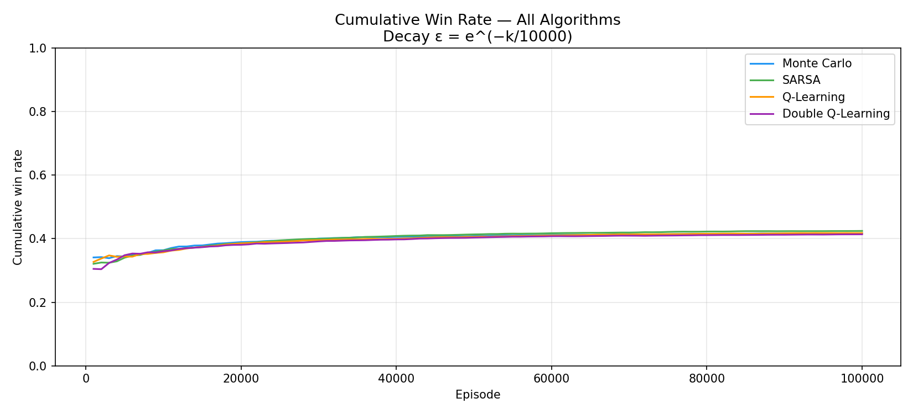
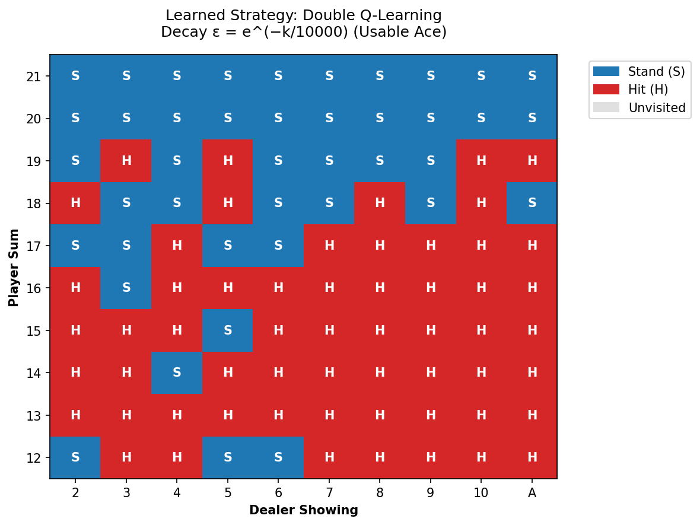

# Reinforcement Learning for Blackjack 🃏

A comparative study of reinforcement learning algorithms applied to Blackjack.

This project implements and evaluates four reinforcement learning approaches — **Monte Carlo Control, SARSA, Q-Learning, and Double Q-Learning** — to investigate how different learning strategies and exploration schedules affect performance in a stochastic Blackjack environment.

## Overview

Blackjack provides a useful environment for studying reinforcement learning because an agent must learn a strategy through repeated interaction while dealing with stochastic outcomes and delayed rewards.

The project models Blackjack as a **Markov Decision Process (MDP)** and compares both on-policy and off-policy learning methods.

The implemented algorithms are:

- Monte Carlo On-Policy Control
- SARSA
- Q-Learning
- Double Q-Learning

The experiments focus on:

- Learning convergence
- Exploration vs exploitation
- Win-rate performance
- State-action coverage
- Learned Blackjack strategies
- Differences between Monte Carlo and Temporal Difference learning

## Blackjack Environment

A custom simplified Blackjack environment is implemented in Python.

Each state is represented as:

```text
(player total, dealer visible card, usable ace)
```

For example:

```text
(18, 10, True)
```

represents a player total of 18, a dealer showing a 10, and the player having a usable Ace.

The agent can choose between two actions:

```text
HIT
STAND
```

Terminal rewards are:

```text
Win  = +1
Draw =  0
Loss = -1
```

Ace values are handled dynamically so that an Ace can change from 11 to 1 when necessary to prevent the player from busting.

## Reinforcement Learning Algorithms

### Monte Carlo Control

Monte Carlo learning estimates action values from complete episodes.

The implementation uses **first-visit Monte Carlo updates**, where only the first occurrence of a state-action pair within an episode contributes to its value update.

### SARSA

SARSA is an **on-policy Temporal Difference algorithm**.

Unlike Monte Carlo, it updates Q-values during an episode using the next action selected by the current policy.

### Q-Learning

Q-Learning is an **off-policy Temporal Difference algorithm**.

Instead of updating toward the action actually selected by the policy, it updates toward the highest estimated Q-value available in the next state.

### Double Q-Learning

Double Q-Learning maintains two independent Q-value tables.

This helps reduce the **maximisation bias** that can occur in standard Q-Learning when the same estimates are used to both select and evaluate actions.

## Exploration Strategies

Multiple ε-greedy exploration configurations were evaluated to study the exploration-exploitation trade-off.

These include:

- Fixed exploration
- Linear/reciprocal decay
- Fast exponential decay
- Slow exponential decay
- Exploring starts

The experiments demonstrate how the rate at which exploration decreases can significantly influence convergence and final policy performance.

## Results

The algorithms were evaluated across thousands of Blackjack episodes using metrics such as:

- Cumulative win rate
- Wins, losses and draws
- State-action visitation counts
- Policy convergence
- Dealer advantage
- Learned strategy distributions

One of the main observations was that exploration strategy had a significant effect on learning performance.

With fast exponential decay, Q-Learning and Double Q-Learning showed strong improvements as exploration decreased, while slower decay allowed algorithms such as SARSA and Q-Learning more time to refine their policies through prolonged exploration.

### Example Performance Comparison



### Learned Strategy

The project also visualises the strategies learned by each agent for different player totals, dealer cards and usable-Ace states.

Example:



Additional experimental plots can be found in:

```text
src/plots/
```

and the raw experiment results are available in:

```text
src/csv/
```

## Project Structure

```text
.
├── README.md
├── Report.pdf
└── src/
    ├── agent.py
    ├── environment.py
    ├── main.py
    ├── plot.py
    ├── csv/
    └── plots/
```

### Main Files

**`agent.py`**  
Contains the implementations of the reinforcement learning agents.

**`environment.py`**  
Implements the Blackjack environment, game mechanics and state transitions.

**`main.py`**  
Runs training and experimental configurations.

**`plot.py`**  
Generates visualisations and comparisons from experimental results.

**`csv/`**  
Contains experimental results, learned policies and state-action statistics.

**`plots/`**  
Contains generated performance and strategy visualisations.

## Technologies

- Python
- NumPy
- Reinforcement Learning
- Monte Carlo Methods
- Temporal Difference Learning
- ε-Greedy Exploration
- Data Analysis and Visualisation

## Full Report

A detailed explanation of the environment, algorithms, experimental methodology and results is available in:

**[Report.pdf](Report.pdf)**

## Authors

**Luke Camilleri**  
**Kurt Abela**

University of Malta  
Reinforcement Learning — ARI2204
